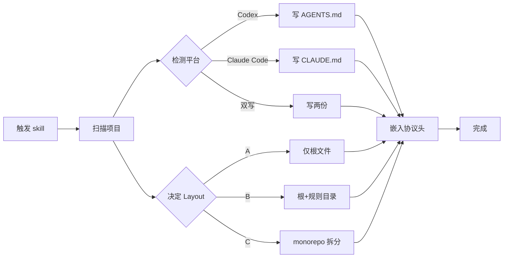

# init-claude-md

> 为项目生成**项目专属的 CLAUDE.md / AGENTS.md** + 活的 **TODO.md** 任务清单，让 Claude Code / Codex 真正读完并执行。
> 零依赖、零 hook、跨平台、自动维护。

[](LICENSE)
[](https://docs.anthropic.com/en/docs/claude-code)
[](https://github.com/openai/codex)
[](https://github.com/LetheChen/init-claude-md/stargazers)
[](https://github.com/LetheChen/init-claude-md/issues)
[](https://github.com/LetheChen/init-claude-md/releases)

[English](#) · [简体中文](#) · [🌟 Star](https://github.com/LetheChen/init-claude-md) · [🐛 提 Issue](https://github.com/LetheChen/init-claude-md/issues/new/choose)

---

## 为什么需要这个 skill？

`CLAUDE.md` / `AGENTS.md` 几乎是 AI 编码工具的"项目记忆"，但 **90% 的项目没有正确生成它们**——文件超长、堆满了 AI 自己读不进去的废话、不会随项目演进。

`init-claude-md` 把这件事做成**一键式 + 自维护**：

| 痛点 | 解法 |
| --- | --- |
| 根文件越写越长（>200 行） | 硬上限 60 行；超过就触发拆分（Layout A/B/C） |
| 规则写完就过期 | **Session Maintenance Protocol** —— 下一次会话 agent 自动按决策表更新 TODO.md 和规则 |
| Claude Code 和 Codex 行为不一致 | 平台无关的指令描述，两边都能跑；默认双写 |
| 装 hook 才能自动维护 | **零 hook、零依赖** —— 协议块嵌入在根文件顶部，纯靠 agent 自觉 |

## Features

- **📐 三种 Layout** — A（单文件） / B（根+规则目录，默认） / C（monorepo）
- **🔀 合并策略** — 已有 CLAUDE.md / AGENTS.md 时按段处理，**绝不覆盖用户真实文本**
- **🌐 平台检测** — 自动识别 Codex / Claude Code / 双写
- **🔧 自我维护** — Session Maintenance Protocol 让 agent 自动续命规则文件
- **📚 实战验证模板** — HumanLayer 极简模式 + Karpathy 4 准则
- **🧪 自我 dogfooding** — 本仓库自己的 AGENTS.md / CLAUDE.md 就是用本 skill 生成的

## 工作流概览



## 快速开始

在项目根目录触发：

```text
init CLAUDE.md
生成 CLAUDE.md
set up Claude Code rules for this project
```

技能会自动：

- 检测技术栈（package.json / pyproject.toml / go.mod ...）
- 检测平台（Codex / Claude Code / 双写）
- 选择 **Layout A**（单文件） / **B**（根+规则目录，默认） / **C**（monorepo）
- 生成根 CLAUDE.md / AGENTS.md + 顶部带 Session Maintenance Protocol 块
- 按 examples/TODO.md 骨架生成 TODO.md
- 如果已有 CLAUDE.md / AGENTS.md / TODO.md，**按合并策略**处理（不覆盖用户真实文本）

## 安装

### Codex (OpenAI)

```text
codex skill install init-claude-md
```

### Claude Code (Anthropic)

```text
git clone https://github.com/LetheChen/init-claude-md ~/.agents/skills/init-claude-md
```

详细步骤见 [references/install.md](references/install.md)。

## 生成的 CLAUDE.md 长什么样

完整示例见 [examples/](examples/)：

````markdown
# CLAUDE.md

## Session Maintenance Protocol

**开始时**：读 TODO.md，复述当前 🔴 和 🟡 段，确认本次会话要推进哪几项。

**结束前**（最后一条用户消息之后、停止前必做）：
1. 回看本次会话实际做了什么
2. 更新 TODO.md（决策表见 [references/session-maintenance-protocol.md](references/session-maintenance-protocol.md)）
3. 更新本文件的规则（如果本次暴露了新约定）
4. 刷新日期戳

**触发条件**：≥1 个源文件被改 · 用户新增了约束 · 会话 > 10 分钟

## Core rules (from Karpathy)
1. Think Before Coding — surface assumptions, push back when warranted
2. Simplicity First — minimum code that solves the problem
3. Surgical Changes — touch only what you must
4. Goal-Driven Execution — define success criteria, loop until verified

## Language
- Communication: zh（用户偏好）
- Code comments: zh
- Commit messages: en（Conventional Commits）
- Rule files: zh

## Project conventions
- All database access goes through /src/db/queries/
- Use pnpm run typecheck after every change
- Never modify migration files after commit

## Verification
Run pnpm run typecheck && pnpm test --changed before stopping.

## Things to avoid
- Do not add dependencies without justification
- Do not refactor unrelated code in a fix
- Do not commit secrets or .env files
````

Rule file — 只在 Agent 触及匹配路径时加载：

````markdown
---
paths:
  - src/db/**
  - prisma/**
---

# Database conventions

## Rules
- Always use prisma. for multi-statement operations
- Migration files are immutable after commit
- Seed data must be idempotent
````

## 生成的 TODO.md 长什么样

````markdown
# 待办清单

> 最后更新：2026-07-03

## 🔴 进行中
- [ ] (P1) 实现用户头像上传到 S3 的预签名 URL 流程  源:src/api/users/upload.ts:42

## 🟡 待处理
- [ ] (P1) 修复登录页在 Safari 17 下的样式错位
- [ ] (P2) 替换 src/legacy/db.js 里所有 var 为 const/let

## 🟢 后续
- [ ] 升级 Next.js 14 → 15

## ✅ 已完成
- [x] 初始化项目 CLAUDE.md + TODO.md (2026-07-03)
````

完整范例见 [examples/TODO.md](examples/TODO.md)。

## 目录结构

```text
init-claude-md/
├── SKILL.md                                # 技能入口 — Agent 工作流指令（中文主体）
├── AGENTS.md                               # 本仓库自己的 Codex 规则文件（self-dogfooding 范例）
├── CLAUDE.md                               # 本仓库自己的 Claude Code 规则文件
├── TODO.md                                 # 本仓库自己的任务清单
├── references/
│   ├── root-template.md                    # 根 CLAUDE.md 骨架（含 Session Maintenance Protocol 头）
│   ├── rule-file-template.md               # 每个 rule 文件的骨架 + paths: 说明
│   ├── content-rules.md                    # 内容取舍规则（放什么、不放什么）
│   ├── rules-splitter.md                   # Layout A/B/C 决策树 + 检测矩阵
│   ├── karpathy-rules.md                   # Karpathy 4 条准则原文
│   ├── session-maintenance-protocol.md     # **会话维护决策表（核心新机制）**
│   ├── install.md                          # 安装到 ~/.codex/skills/ 的步骤
│   └── quick-start.md                      # 5 分钟上手指南
├── examples/
│   ├── humanlayer-CLAUDE.md                # HumanLayer 模式范例（带协议头）
│   ├── karpathy-CLAUDE.md                  # 纯 Karpathy 模式范例（带协议头 + Language 段）
│   ├── monorepo-root-CLAUDE.md             # Layout C: workspace 根
│   ├── monorepo-package-AGENTS.md          # Layout C: 子包（带 paths: frontmatter）
│   ├── api-conventions.md                  # 单个 rule 文件范例（带 paths: + good/bad 示例）
│   └── TODO.md                             # 完整 TODO.md 范例
├── README.md
├── CONTRIBUTING.md
├── .gitignore
├── LICENSE
└── .github/
    ├── ISSUE_TEMPLATE/
    │   ├── bug_report.md
    │   ├── feature_request.md
    │   └── config.yml
    └── PULL_REQUEST_TEMPLATE.md
```

## 跨平台兼容

| 操作 | Claude Code | Codex |
| --- | --- | --- |
| 文件扫描 | Glob, Grep, Read | shell_command (rg, ls) |
| 读取文件 | Read | shell_command (cat) |
| 写入文件 | Write, Edit | apply_patch |
| 平台判断 | .claude/ 目录存在 | .codex/ 目录存在 |
| 默认行为 | 写 CLAUDE.md | 写 AGENTS.md |

SKILL.md 使用意图驱动的描述（find and read these files），两个平台的 Agent 都能用自己的工具执行。**不绑定任何一方的工具名**。

**默认双写**：当两个平台信号都没检测到时，skill 会同时写 CLAUDE.md 和 AGENTS.md（同样内容），最安全。

## License

MIT — use it, fork it, ship it. Attribution appreciated but not required.

## Contributing

欢迎提交 Issue 和 PR。详见 [CONTRIBUTING.md](CONTRIBUTING.md)。

## Community

| 渠道 | 链接 |
| --- | --- |
| 🐛 Bug 报告 | [Issue Tracker](https://github.com/LetheChen/init-claude-md/issues/new?template=bug_report.md) |
| 💡 功能建议 | [Feature Request](https://github.com/LetheChen/init-claude-md/issues/new?template=feature_request.md) |
| 🔀 提交代码 | [Pull Requests](https://github.com/LetheChen/init-claude-md/pulls) |
| ⭐ 给个 Star | [Star this repo](https://github.com/LetheChen/init-claude-md) |
| 👀 Watch 接收更新 | [Watch → All Activity](https://github.com/LetheChen/init-claude-md/watchers) |

## Roadmap

- [x] Layout A/B/C 决策树 + 合并策略
- [x] Session Maintenance Protocol 软自动维护
- [x] 跨 Codex / Claude Code 平台
- [x] 自我 dogfooding（本仓库自带 AGENTS.md / CLAUDE.md）
- [ ] 英文 README
- [ ] CI 检测根文件行数（防止越线）
- [ ] 实测更多 monorepo 框架（Nx / Turborepo / pnpm workspace）

## Star History

如果这个 skill 帮到了你，**点个 ⭐ Star** 就是最大的支持 ✨

[](https://star-history.com/#LetheChen/init-claude-md&Date)

---

**Maintainer**: [@LetheChen](https://github.com/LetheChen) · **License**: MIT